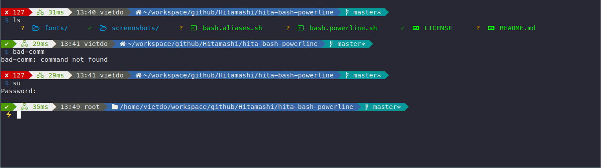

# hita-bash-powerline

My config for bash


## Features
- Git folder info
- Network info (ping to google DNS)
- Current directory icon
- Prompt symbol change when use as root

## Installation

Add to `$HOME/.bashrc` (user only) or `/etc/bash.bashrc` (system)
```
# .bashrc
[ -f ~/bash.powerline.sh ] && source ~/.bash.powerline.sh
[ -f ~/bash.powerline.sh ] && source ~/.bash.aliases.sh

# /etc/bash.bashrc
[ -f /etc/bash.powerline.sh ] && source /etc/.bash.powerline.sh
[ -f /etc/bash.powerline.sh ] && source /etc/.bash.aliases.sh
```

Copy file to `$HOME` (user) or `/etc` (system)
```
bash.powerline.sh -> ~/.bash.powerline.sh
bash.aliases.sh -> ~/.bash.aliases.sh
```

## Credits
- Inspired by: [riobard/bash-powerline](https://github.com/riobard/bash-powerline)
- Fonts: [Nerd fonts](https://github.com/ryanoasis/nerd-fonts)
- Beautiful `ls`: [colorls](https://github.com/athityakumar/colorls)
